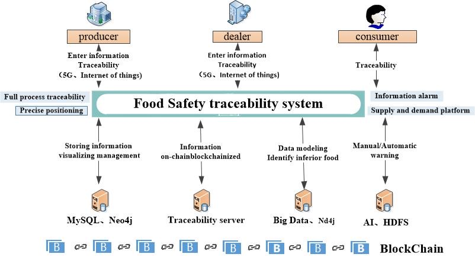
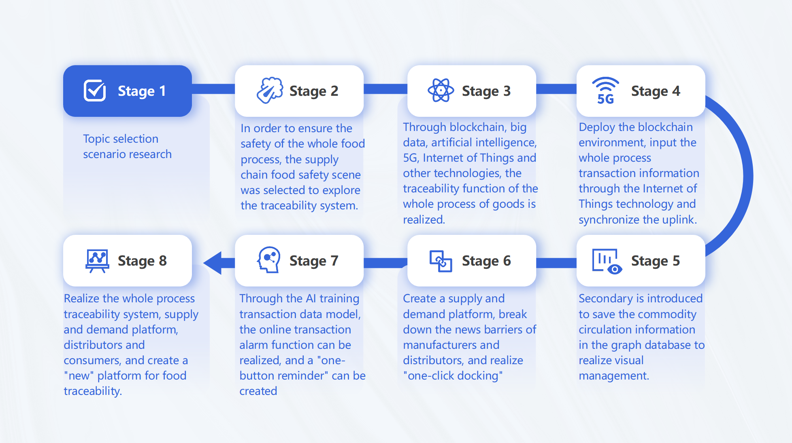

# supplyChain
食品安全溯源系统

# **1. The issue we are hoping to solve**

Due to the problem of nuclear sewage discharge, food safety has once again attracted people's attention. In this scheme, a new food traceability system is introduced through blockchain, big data, artificial intelligence, Internet of Things and other technologies, which provides one-button alarm, visual management, accurate positioning of inferior food, platform product sales and other functions in addition to realizing the traceability information of the whole transaction process, safeguarding consumers' due rights and interests, and effectively punishing those who cause food safety accidents. 

# **2. How our technology solution can help**

trace to the source ,early warning ,Platform marketing ,credible ,Production orientation 

# **3. the description of our team’s solution**

Through blockchain, big data, artificial intelligence, Internet of Things and other technologies, a new food traceability system is launched, which provides one-click alarm, visual management, accurate positioning of inferior food and other functions in addition to realizing the whole process traceability information of manufacturers, distributors and consumers, and at the same time creates a supply and demand platform to realize one-click docking of manufacturers and distributors, creating a "new" platform for food traceability. 
The platform creates a characteristic interface for manufacturers, distributors and consumers, and collects, sorts out and stores relevant data indicators in all aspects of food safety through the Internet of Things; Realize the full link information uplink of food transportation through blockchain technology; Through secondary, the commodity circulation information is saved in the graph database neo4j realize visual management; Training transaction data model through artificial intelligence to realize online transaction alarm; At the same time, it provides a rich sales and purchase platform for manufacturers and distributors. Information asymmetry is the root cause of food safety problems. We use manual early warning and automatic early warning to give manual early warning when manufacturers find problems with raw materials. When the product has actually expired, it will give an automatic warning, give consumers an immediate warning display and protect consumers' rights and interests. 
Improve the food supply system and establish the whole process traceability and alarm system, so as to improve the resilience of the food supply chain and effectively protect the rights and interests of consumers. 

 

 

# **4. How To Run This Project?**

**4.1 Start Fabric1.4 and copy crypto-config to resources\crypto-config and modify SdkMain.java "keyFileName", application.yaml "keyFileName".**

**4.2 create database fabric and modify application.yaml datasource.**

**4.3 start neo4j4.x and modify neo4j.**

**4.4 run initChain.java.**

**4.5 run supplyChainDemo.java.**

introduce video:
https://www.youtube.com/watch?v=6AeSpJaU8jk
